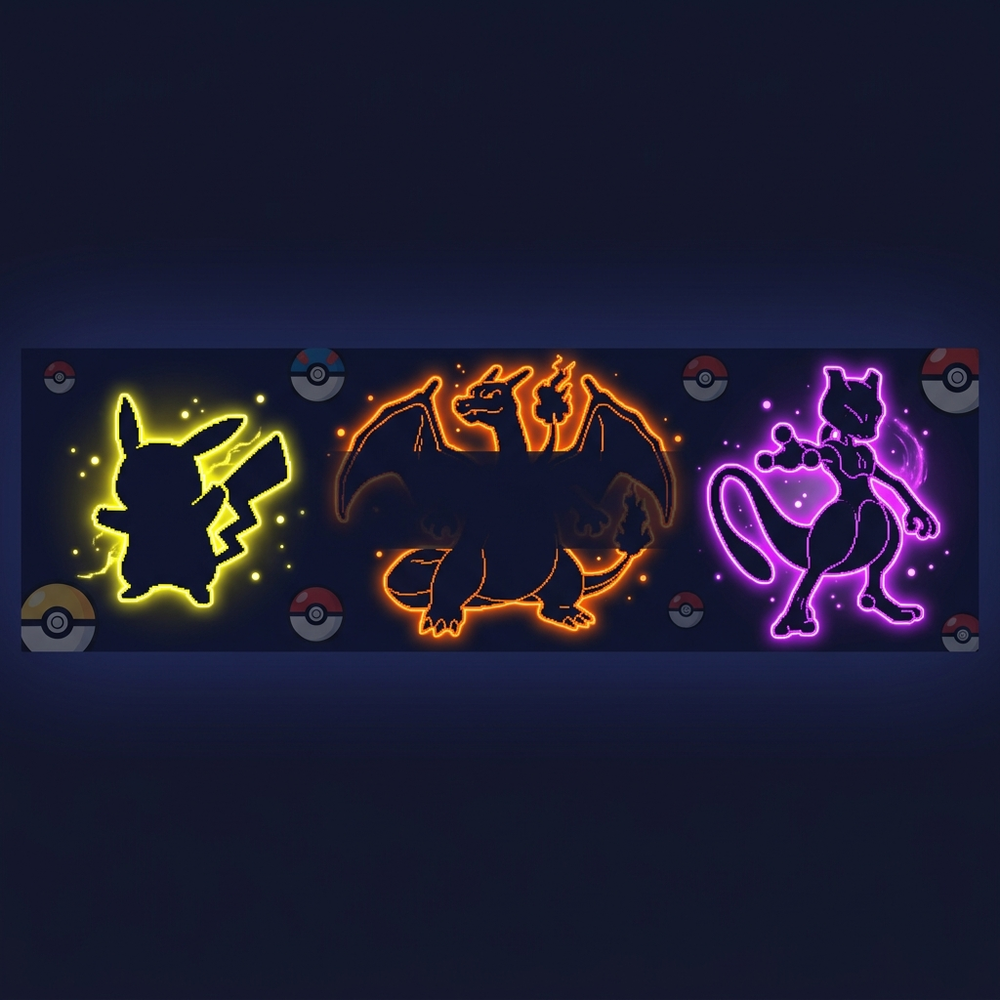
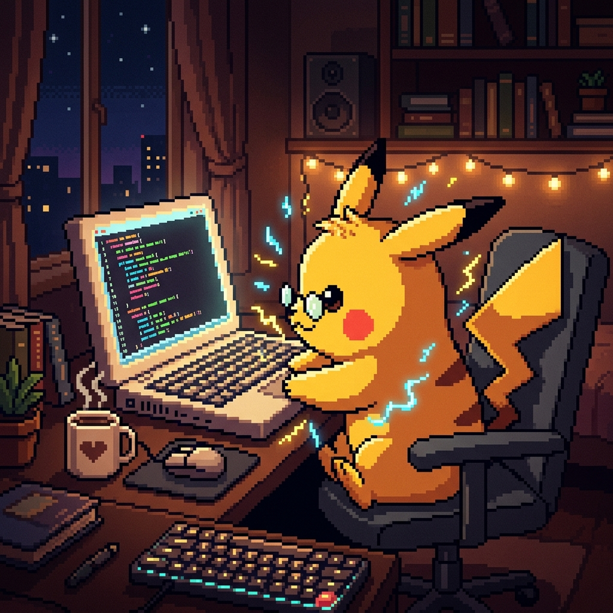

<!-- ═══════════════════════════════════════════════════════════════════════════════ -->
<!-- ⚡ POKEMON-THEMED GITHUB PROFILE — Shashwat Shukla ⚡ -->
<!-- ═══════════════════════════════════════════════════════════════════════════════ -->

<div align="center">

<!-- 🔥 ANIMATED POKEMON BANNER -->


<!-- ⚡ POKEBALL DIVIDER -->
<br>


<!-- ⚡ TYPING ANIMATION HEADER -->
<br><br>

<a href="https://git.io/typing-svg">
  
</a>

<br>

<picture>
  <source media="(prefers-color-scheme: dark)" srcset="https://capsule-render.vercel.app/api?type=waving&color=0:F8D030,50:F08030,100:7038F8&height=100&section=header&text=🎮%20TRAINER%20CARD%20🎮&fontSize=30&fontColor=ffffff&fontAlignY=35&animation=twinkling">
  
</picture>

</div>

<!-- ═══════════════════════════════════════════════════════════════════════════════ -->

<div align="center">

##  About This Trainer 

</div>

<table align="center">
<tr>
<td width="45%" valign="top">



</td>
<td width="55%" valign="top">

| Field | Details |
|:---:|:---|
| 🎮 **Name** | Shashwat Shukla |
| 📍 **Region** | Jaunpur, UP → Navi Mumbai |
| 🏫 **Academy** | A.C. Patil College of Engineering |
| 🎓 **Class** | B.E. Computer Engg. — 2027 |
| ⚡ **Type** | AI/ML & Generative AI |
| 🔥 **Title** | LLM & RAG App Builder |

</td>
</tr>
</table>

<!-- ═══════════════════════════════════════════════════════════════════════════════ -->

<div align="center">

##  Pokédex of Skills 

<br>

<!-- ⚡ TYPE: ELECTRIC — Languages -->

<br><br>


<br><br>

<!-- 🔥 TYPE: FIRE — Frameworks -->

<br><br>


<br><br>

<!-- 🧬 TYPE: PSYCHIC — AI/ML -->

<br><br>


<br><br>

<!-- 🐉 TYPE: DRAGON — Tools -->

<br><br>


</div>

<br>

<!-- ═══════════════════════════════════════════════════════════════════════════════ -->

<div align="center">

##  Battle Stats 

<br>

<!-- GitHub Stats Cards -->
<a href="https://github.com/shashwat230710">
  
</a>
<a href="https://github.com/shashwat230710">
  
</a>

<br><br>

<!-- Streak Stats -->
<a href="https://github.com/shashwat230710">
  
</a>

<br><br>

<!-- Activity Graph -->
<a href="https://github.com/shashwat230710">
  
</a>

</div>

<br>

<!-- ═══════════════════════════════════════════════════════════════════════════════ -->

<div align="center">

##  Pokémon Party (Top Projects) 

<br>

<a href="https://github.com/shashwat230710/AI-Research-Assistant-RAG-System-">
  
</a>
<a href="https://github.com/shashwat230710/Q-A-Chatbot-Using-LangSmith-API">
  
</a>

<br>

<a href="https://github.com/shashwat230710/Fake-News-Detector">
  
</a>
<a href="https://github.com/shashwat230710/Next-Word-Predictor">
  
</a>

</div>

<br>

<!-- ═══════════════════════════════════════════════════════════════════════════════ -->

<div align="center">

##  Gym Badges & Achievements 

</div>

<table align="center">
<tr>
<td align="center" width="50%">

###  HackerRank Arena


<br>
🏆 **Elite Trainer Status!**

</td>
<td align="center" width="50%">

###  LeetCode Battleground


<br>
⚔️ **Battle-Hardened Coder!**

</td>
</tr>
</table>

<div align="center">

###  Trainer Certifications (TM Collection)

|  | Certification | Status |
|:---:|:---|:---:|
| 🧬 | **NPTEL** — Programming in Gen AI | ✅ |
| 📊 | **Complete DS, ML, DL & NLP Bootcamp** | ✅ |
| 🤖 | **Gen AI Course** — LangChain & Hugging Face | ✅ |
| 🌍 | **Global Internship** — Cloud Counselage | ✅ |
| 💡 | **Innovathon 2025** — Participation | ✅ |

</div>

<br>

<!-- ═══════════════════════════════════════════════════════════════════════════════ -->

<div align="center">

##  Wild Encounter — Experience 

```
╔═══════════════════════════════════════════════════════╗
║  🏢 Cloud Counselage Pvt. Ltd.                       ║
║  ⚡ Global Professional Intern · 2 Months             ║
║                                                       ║
║  🎯 Moves Learned:                                    ║
║     • Web Development (Super Effective!)              ║
║     • React.js (Critical Hit!)                        ║
║     • Data Science (It's Very Effective!)             ║
║                                                       ║
║  💫 EXP: ████████████████████████░░ 90%               ║
╚═══════════════════════════════════════════════════════╝
```

</div>

<br>

<!-- ═══════════════════════════════════════════════════════════════════════════════ -->

<div align="center">

##  Connect with This Trainer 

<br>

<a href="mailto:shashwatxiia1415@gmail.com">
  
</a>
&nbsp;
<a href="https://www.linkedin.com/in/shaswatshukla">
  
</a>

<br>

<a href="https://leetcode.com/u/shaswatshukla/">
  
</a>
&nbsp;
<a href="https://www.hackerrank.com/profile/shaswatshukla">
  
</a>

</div>

<br>

<!-- ═══════════════════════════════════════════════════════════════════════════════ -->

<div align="center">

<!-- Profile Views & Trophies -->


<br><br>

<a href="https://github.com/ryo-ma/github-profile-trophy">
  
</a>

</div>

<br>

<!-- ═══════════════════════════════════════════════════════════════════════════════ -->

<!-- 🎮 POKEMON TEAM FOOTER -->
<div align="center">


<br>


<br>

*⚡ If you liked this profile, don't forget to ⭐ star my repos! ⚡*


</div>

<!-- ═══════════════════════════════════════════════════════════════════════════════ -->
<!-- ⚡ END OF POKEMON TRAINER PROFILE — GOTTA CODE 'EM ALL! ⚡ -->
<!-- ═══════════════════════════════════════════════════════════════════════════════ -->
