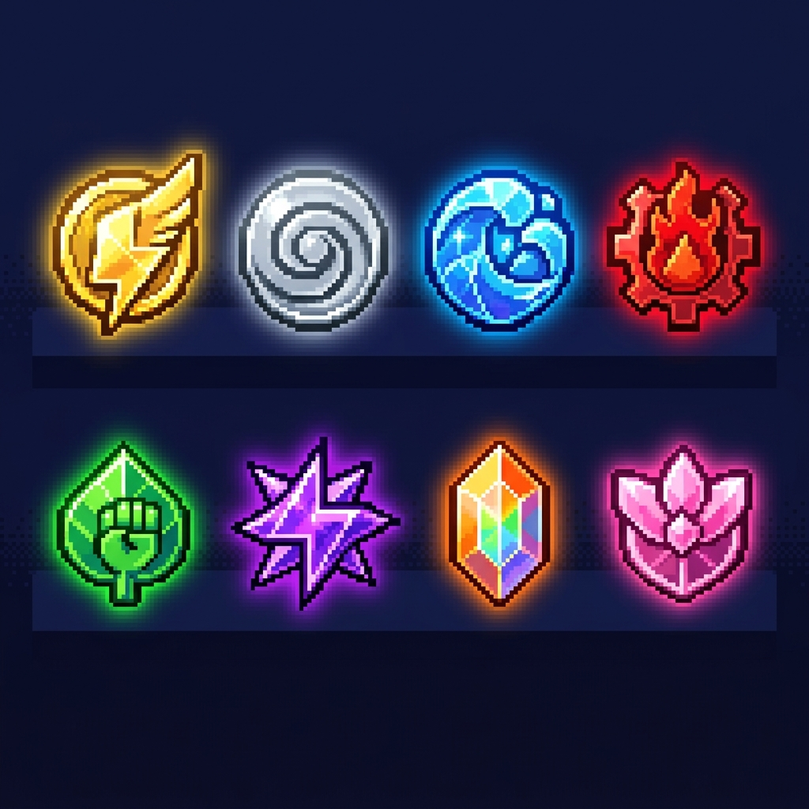

<!-- ═══════════════════════════════════════════════════════════════════════════════ -->
<!-- ⚡ POKEMON-THEMED GITHUB PROFILE — Shashwat Shukla ⚡ -->
<!-- ═══════════════════════════════════════════════════════════════════════════════ -->

<div align="center">

<!-- 🔥 ANIMATED POKEMON BANNER -->


<!-- ⚡ POKEBALL OPENING ANIMATION -->
<br>


<!-- ⚡ TYPING ANIMATION HEADER -->
<br><br>

<a href="https://git.io/typing-svg">
  
</a>

<br>

<!-- 🎮 POKEMON TRAINER CARD -->
<picture>
  <source media="(prefers-color-scheme: dark)" srcset="https://capsule-render.vercel.app/api?type=waving&color=0:F8D030,50:F08030,100:7038F8&height=120&section=header&text=🎮%20TRAINER%20CARD%20🎮&fontSize=35&fontColor=ffffff&fontAlignY=35&animation=twinkling">
  
</picture>

</div>

<!-- ═══════════════════════════════════════════════════════════════════════════════ -->

<div align="center">

##  About This Trainer 

</div>

<table align="center">
<tr>
<td width="50%" valign="top">


</td>
<td width="50%" valign="top">

### 🏷️ Trainer Profile

| Field | Details |
|:---:|:---|
| 🎮 **Name** | Shashwat Shukla |
| 📍 **Region** | Jaunpur, Uttar Pradesh, India |
| 🏫 **Academy** | A. C. Patil College of Engineering, Navi Mumbai |
| 🎓 **Graduation** | B.E. Computer Engineering — Class of 2027 |
| ⚡ **Class** | AI/ML & Generative AI Enthusiast |
| 🔥 **Title** | LLM & RAG Application Builder |
| 🌐 **Languages** | Hindi 🇮🇳 (Native) • English 🇬🇧 (Professional) |

</td>
</tr>
</table>

<!-- ═══════════════════════════════════════════════════════════════════════════════ -->

<div align="center">

##  Trainer Summary 

</div>

<div align="center">


</div>

> *"Like a Pokémon trainer on a journey, I explore every route — from AI/ML forests to Web Dev cities — catching new skills and evolving with each challenge!"*

Currently pursuing a **Bachelor of Engineering in Computer Engineering** at **A. C. Patil College of Engineering, Navi Mumbai**, with an expected graduation in **2027**. Recently completed a **two-month Global Professional Internship** at **Cloud Counselage Pvt. Ltd.**, where I contributed to projects leveraging my knowledge in **web development, React.js, and data science**.

Dedicated to enhancing technical skills, with certifications in **Python** and participation in **Innovathon 2025**. Motivated to explore impactful opportunities in **software development, data science, and web technologies**. Excited to collaborate on projects at the intersection of **technology and creativity**. ⚡

<br>

<!-- ═══════════════════════════════════════════════════════════════════════════════ -->

<div align="center">

##  Pokédex of Skills 

*Every skill is a Pokémon move — gotta master 'em all!*

<br>

<!-- ⚡ TYPE: ELECTRIC — Languages -->

<br><br>


<br><br>

<!-- 🔥 TYPE: FIRE — Frameworks & Libraries -->

<br><br>


<br><br>

<!-- 🧬 TYPE: PSYCHIC — AI/ML -->

<br><br>


<br><br>

<!-- 🐉 TYPE: DRAGON — Tools & Platforms -->

<br><br>


</div>

<br>

<!-- ═══════════════════════════════════════════════════════════════════════════════ -->

<div align="center">

##  Battle Stats 

*"A trainer is judged by their battle record!"*

<br>

<!-- GitHub Stats Cards with Pokemon Colors -->
<a href="https://github.com/anuraghazra/github-readme-stats">
  
</a>
<a href="https://github.com/anuraghazra/github-readme-stats">
  
</a>

<br><br>

<!-- Streak Stats -->
<a href="https://github.com/DenverCoder1/github-readme-streak-stats">
  
</a>

<br><br>

<!-- Activity Graph -->
<a href="https://github.com/ashutosh00710/github-readme-activity-graph">
  
</a>

</div>

<br>

<!-- ═══════════════════════════════════════════════════════════════════════════════ -->

<div align="center">

##  Gym Badges & Achievements 



<br>

*Badges earned on the coding journey — each one a milestone!*

</div>

<br>

<table align="center">
<tr>
<td align="center" width="50%">

###  HackerRank Arena


<br>

<br><br>
*Secured 5-Star Badge in Problem Solving & C++*
<br>
🏆 **Elite Trainer Status Unlocked!**

</td>
<td align="center" width="50%">

###  LeetCode Battleground


<br>

<br><br>
*350+ DSA Problems Conquered with Active Contest Participation*
<br>
⚔️ **Battle-Hardened Coder!**

<a href="https://leetcode.com/u/shaswatshukla/">
  
</a>

</td>
</tr>
</table>

<br>

<div align="center">

###  Trainer Certifications (TM Collection)

<br>

|  | Certification | Status |
|:---:|:---|:---:|
| 🧬 | **NPTEL Certification** — Programming in Gen AI | ✅ Earned |
| 📊 | **Complete Data Science, ML, DL & NLP Bootcamp** | ✅ Earned |
| 🤖 | **Complete Generative AI Course** — LangChain & Hugging Face | ✅ Earned |
| 🌍 | **Global Professional Internship** — Cloud Counselage Pvt. Ltd. | ✅ Earned |
| 💡 | **Certificate of Participation** — Innovathon 2025 | ✅ Earned |
| 🤝 | **IAC Pledge** | ✅ Earned |

</div>

<br>

<!-- ═══════════════════════════════════════════════════════════════════════════════ -->

<div align="center">

##  Experience — Wild Encounters 

</div>

<div align="center">

```
╔══════════════════════════════════════════════════════════════════╗
║                                                                  ║
║   🏢 Cloud Counselage Pvt. Ltd.                                 ║
║   ⚡ Global Professional Intern                                  ║
║   📅 2-Month Adventure                                           ║
║                                                                  ║
║   🎯 Moves Learned:                                              ║
║      • Web Development (Super Effective!)                        ║
║      • React.js (Critical Hit!)                                  ║
║      • Data Science (It's Very Effective!)                       ║
║                                                                  ║
║   💫 EXP Gained: ████████████████████████░░ 90%                  ║
║                                                                  ║
╚══════════════════════════════════════════════════════════════════╝
```

</div>

<br>

<!-- ═══════════════════════════════════════════════════════════════════════════════ -->

<div align="center">

##  Pokémon Party (Top Projects) 

*My best Pokémon in the battle lineup!*

<br>

<a href="https://github.com/shaswatshukla?tab=repositories">
  
</a>

<br><br>

*⬆️ Pin your best repos and they'll appear here like Pokémon in your party!*

</div>

<br>

<!-- ═══════════════════════════════════════════════════════════════════════════════ -->

<div align="center">

##  Trainer Recommendations 

*What other trainers say about my battle skills!*

</div>

<br>

<table align="center">
<tr>
<td>

>  *"Shashwat is one of the most dedicated and enthusiastic developers I've worked with. His ability to quickly grasp complex AI/ML concepts and apply them practically is remarkable. Like a Pokémon that evolves through sheer determination, Shashwat consistently levels up his skills and delivers quality results."*
>
> — **Fellow Trainer @ Cloud Counselage**

</td>
</tr>
<tr>
<td>

>  *"Working alongside Shashwat during Innovathon 2025 was an incredible experience. His creative problem-solving approach and deep understanding of generative AI technologies made him an invaluable team member. He doesn't just code — he strategizes like a true Pokémon Master!"*
>
> — **Innovathon 2025 Teammate**

</td>
</tr>
</table>

<br>

<!-- ═══════════════════════════════════════════════════════════════════════════════ -->

<div align="center">

##  Connect with This Trainer 

*Let's trade Pokémon... I mean, ideas!* 😄

<br>

<a href="mailto:shashwatxiia1415@gmail.com">
  
</a>

<br>

<a href="https://www.linkedin.com/in/shaswatshukla">
  
</a>

<br>

<a href="https://leetcode.com/u/shaswatshukla/">
  
</a>

<br>

<a href="https://www.hackerrank.com/profile/shaswatshukla">
  
</a>

<br>


</div>

<br>

<!-- ═══════════════════════════════════════════════════════════════════════════════ -->

<div align="center">

##  Legendary Contribution Graph 

<!-- Snake animation -->
<picture>
  <source media="(prefers-color-scheme: dark)" srcset="https://raw.githubusercontent.com/shaswatshukla/shaswatshukla/output/github-snake-dark.svg" />
  <source media="(prefers-color-scheme: light)" srcset="https://raw.githubusercontent.com/shaswatshukla/shaswatshukla/output/github-snake.svg" />
  
</picture>

*🐍 Watch the snake eat my contributions!*

</div>

<br>

<!-- ═══════════════════════════════════════════════════════════════════════════════ -->

<div align="center">

<!-- Profile Views & Trophies -->


<br><br>

<a href="https://github.com/ryo-ma/github-profile-trophy">
  
</a>

</div>

<br>

<!-- ═══════════════════════════════════════════════════════════════════════════════ -->

<!-- 🎮 POKEMON TEAM ANIMATION FOOTER -->
<div align="center">


<br>


<br>

```
                     ⣀⣤⣤⡀
                    ⣼⣿⣿⣿⣿⡄         "The journey of a Pokémon Master
                   ⣿⣿⣿⣿⣿⣿⣿          begins with a single line of code."
                  ⢸⣿⣿⣿⣿⣿⣿⣿⡇
                   ⠻⣿⣿⣿⣿⣿⠟                    — Shashwat Shukla
                    ⠈⠛⠛⠛⠁
```


<br>

*⚡ If you liked this profile, don't forget to ⭐ star my repos! ⚡*


</div>

<!-- ═══════════════════════════════════════════════════════════════════════════════ -->
<!-- ⚡ END OF POKEMON TRAINER PROFILE — GOTTA CODE 'EM ALL! ⚡ -->
<!-- ═══════════════════════════════════════════════════════════════════════════════ -->
